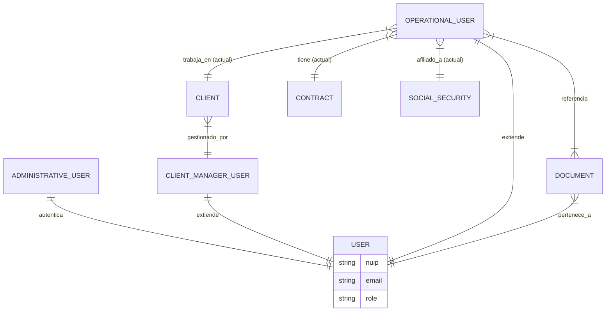

# 🚀 Delfos Backend - Changelog & Features

**Delfos** es un sistema backend robusto diseñado para la gestión integral de seguridad privada, centralizando la administración de personal operativo, documentación legal y control de acceso jerárquico.

## 🌟 Características Desarrolladas

### 1. 🔐 Módulo de Autenticación y Seguridad (Auth Core)

* **Login Optimizado (Fail Fast):** Implementación de estrategia de "Fallo Rápido". El sistema rechaza roles no autorizados o pendientes *antes* de procesar la encriptación (bcrypt), optimizando el uso de CPU.
* **Generación de Tokens (JWT):** Creación de JSON Web Tokens seguros para manejo de sesión sin estado.
* **Protección Jerárquica (Role Hardening):**
    * **Sistema de Listas Negras (`$nin`) en Mongoose:** Un usuario de rango `admin` no puede ver, editar ni eliminar a un `root` o `superadmin`.
    * Validación estricta en endpoints de eliminación para proteger al usuario Root.
* **Sanitización de Respuestas:** Eliminación de datos sensibles (passwords, versiones de `__v`) y estandarización de mensajes de error para evitar "User Enumeration".

### 2. 👥 Gestión de Usuarios (User Module)

* **CRUD Completo:**
    * `POST /api/v1/users`: Registro con hash de contraseñas.
    * `GET /api/v1/users`: Listado con filtros de visibilidad automática según el rol del que consulta.
    * `GET /api/v1/users/:id`: Búsqueda detallada.
    * `PATCH /api/v1/users/:id`: Actualización controlada (bloqueo de campos sensibles como `role` o `status` para usuarios sin privilegios).
    * `DELETE /api/v1/users/:id`: Eliminación lógica/física con validación de jerarquía.
* **Perfiles Operativos:** Lógica base para vincular usuarios con perfiles de guardias de seguridad (`OperationalUser`).

### 3. ☁️ Gestión Documental y Cloud (Documents Module)

* **Integración con Cloudinary (V2):**
    * Configuración de `multer-storage-cloudinary` con parche de compatibilidad para Node v24+.
    * Soporte para subida de múltiples formatos (`pdf`, `jpg`, `png`).
* **Registro de Metadatos:**
    * Almacenamiento de URLs seguras (`secure_url`), `publicId` (para borrado), `mimeType` y `size`.
* **Ciclo de Vida Completo (Full Cycle Delete):**
    * Al eliminar un documento, el sistema ejecuta una **transacción distribuida manual**:
        1.  🔥 Elimina el archivo físico en la nube (Cloudinary).
        2.  🗄️ Elimina el registro en MongoDB.
        3.  🧹 Desvincula (Pull) la referencia del array de documentos del Usuario.
* **Validaciones de Negocio:**
    * Reglas estrictas según `documentType` (ej: Un "Curso de Vigilancia" exige `verificationCode` y `expiryDate` obligatorios).

### 4. ⚙️ Ingeniería y Arquitectura

* **Entorno:** Configuración de variables de entorno (`.env`) segura para credenciales de DB y Cloudinary.
* **Control de Versiones:** Estandarización de mensajes de commit (Conventional Commits: `feat`, `fix`, `refactor`).
* **Infraestructura:** Configuración de `.gitignore` para excluir archivos temporales y `node_modules`.

## 🌟 Tecnologías

- Node.js
- Express
- Mongoose
- MongoDB
- Mongo Compass
- Cloudinary
- Multer
- Multer Storage Cloudinary
- Bcrypt
- JsonWebToken
- dotenv
- Conventional Commits
- Git
- GitHub
- VSCode
- Postman

## 🏛️ Arquitectura de la Base de Datos

Aquí puedes ver cómo se relacionan los modelos del sistema (Core vs Perfiles):

## 🏛️ Arquitectura de Base de Datos (ERD)

                                            +------------------+
                                            |      USER        |
                        +-------------------+     (CORE)       +-------------------+
                        |                   +---------+--------+                   |
                        | 1:1                         | 1:1                        | 1:1
            +---------v---------+         +---------v----------+       +---------v---------+
            |   ADMINISTRATIVE  |         |    OPERATIONAL     |       |   CLIENTMANAGER   |
            |      (Login)      |         |     (Profile)      |       |     (Profile)     |
            +-------------------+         +---------+----------+       +---------+---------+
            | _id               |         | _id     |          |       | _id     |         |
            | user      (Ref)   |         | user    (Ref)      |       | user    (Ref)     |
            | password          |         | documents [Ref]    |       | phones, address   |
            +-------------------+         |                    |       +---------+---------+
                                            | [RELACIONES]       |                 ^
                                            |                    |                 | 1:N
            +--------------------------------+----------------+   |       +---------+---------+
            |                  |             |                |   |       |      CLIENT       |
            | 1:N              | 1:N         | 1:N            |   +-------+     (Company)     |
    +-------v------+   +-------v-------+  +--v--+  +----------v---------+ +-------------------+
    |   CONTRACT   |   | SOCIALSECURITY|  | DOC |  | clientHistory []   | | _id               |
    +--------------+   +---------------+  +--+--+  | currentClient (Ref)|>+ clientManager(Ref)|
    | _id          |   | _id           |     |     +--------------------+ | managersHist []   |
    | content      |   | eps, arl      |     |                            | nit, companyName  |
    | startDate    |   | pensionFund   |     |                            +-------------------+
    | isActive     |   | lifeInsurance |     |
    +--------------+   +---------------+     |
                                            |
                                            | 1:N (Propiedad)
                                    +------v-------+
                                    |   DOCUMENT   |
                                    +--------------+
                                    | _id          |
                                    | user   (Ref) |
                                    | url, publicId|
                                    | docType      |
                                    +--------------+